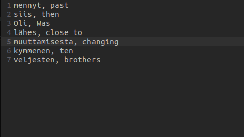
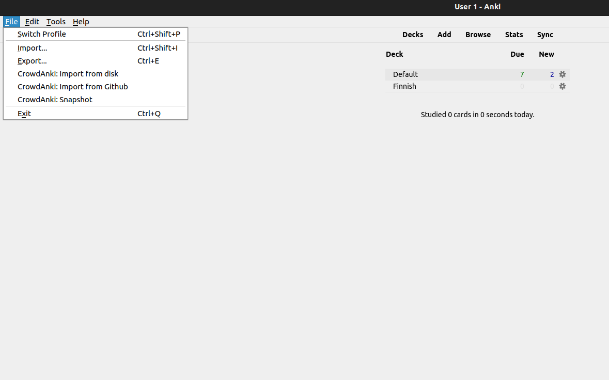
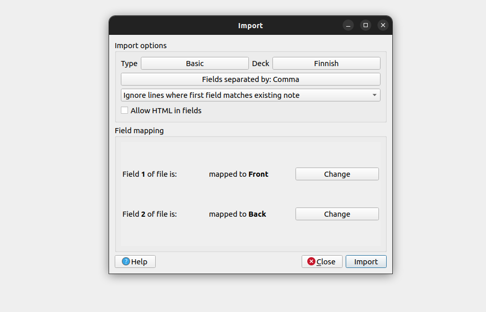
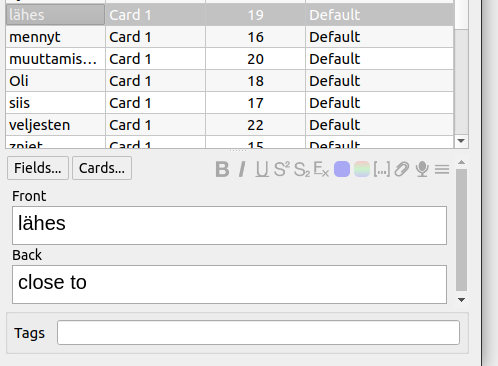
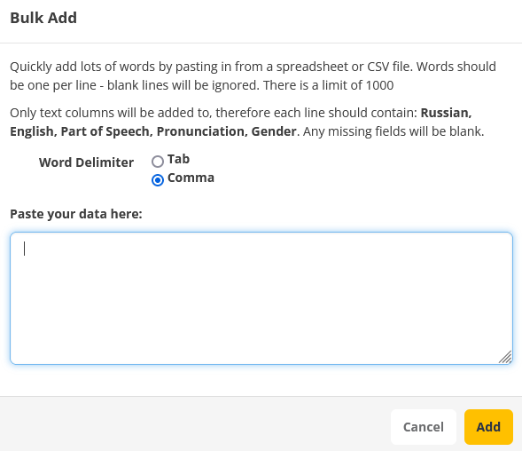

# Exporting words to flashcard systems

Let's suppose you have studied a text, and have encountered x new words that you didn't know. If you didn't use this tool you would
have to manually insert all the words and their respective translations inside anki (or whatever other flashcard system you are currently using).

Thankfully, LinGo automates all of this for you. This is what the so-called 'dictionary file' we mentioned before is for. You can decide to create a dictionary file inside the text selection menu or directly inside the text youre currently studying.

Once you have created the dictionary file by pressing f, go inside the /languages folder and look for the folder of the language you're currently studying: inside you should now find a file called "dictionary.txt". 

Let's give an example: if you're studying finnish, this is where you will find said file inside the project files:

```bash
/src
.
├─ languages
│  ├─ romanian
│  ├─ finnish
      ├─ info.txt
      ├─ words.json
      └─ dictionary.txt <--- this is our file
   ├─ russian
    ....
```

When you will open it, it will look something like this



We will now see how to import this in both anki and memrise:


## Importing your words into anki flashcards

To import your words into anki, it's super simple; open anki and select the deck you want to import the cards to (for this example I created a deck called 'finnish'). Click on the file tab on the top-left of the screen:



Once you have done this, click on the 'import' button. This will open a file explorer; select the dictionary.txt file we mentioned before as the file to import. Once you have selected your file, you will be presented with the following screen:



Keep the options as follows and click on import; you are done! You are now ready to study your new flashcards in anki



## Importing your words in Memrise

To import your words into memrise, create a new course (or select an existing one created by yourself).

Once you're there, click on the "modify course" tab, and you will be greeted with an interface showing all your flashcards. Here, click on "advanced" on the top-right corner of the page; this should open a drop-down menu. Select "bulk add words".


This should open the following screen:




Select "comma" as word delimiter (this is very important for the correct functioning of the import). Lastly paste the content of your dictionary.txt file in the "paste your date here" form. Finally, click on "add". 


Congratulations, you are now ready to study the flashcards for your new words on memrise too!  


## Table of contents:

[[toc]]