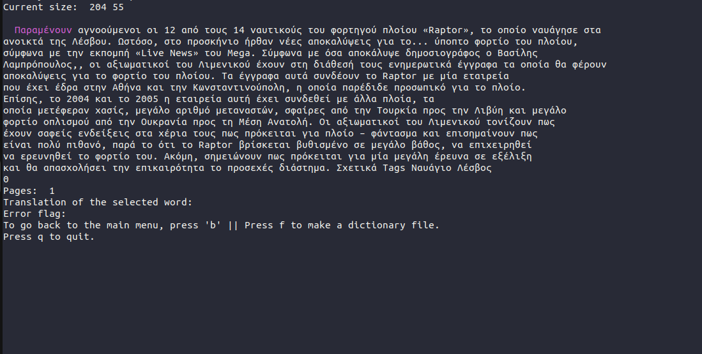

# Loading texts in LinGo

Now that you have opened your application, you will be greeted by the following language selection menu: to navigate it, you can use your down/up arrows or alternatively the keys j and k (j for down and k for up). To select a language just press enter. 

Once you will have selected a language to study, you will be confronted with your text selection menu; this is where you will be able to load in the application and study one of the texts you have imported. Again here you can move between the various choices by using the arrow keys or the j/k keys (VIM style).

 To go back to the language selection menu you can press 'b'. To quit the application you can press 'q'. To select ad open a text just press enter.

You might be confused by the word "dictionary file": for now don't worry about it; we will cover it in the section [exporting your words to Anki/memrise].

By opening a text, you will be confronted by the following screen:

The application works as follows: the text you inserted gets tokenized (i.e it gets split up into words). You can navigate in it with a cursor that points to a word. To move with your cursor you can use the arrow keys or alternatively the keys 'h','j','k' and 'l' (j to move down, k to move up, h to move left and l to move right). 

The text might be comprised of several pages: to move to the next page press the key 'd', to move to the previous one you can press 'a'. 

When the text has many pages, going with the cursor to the current page might be cumbersome and time consuming; thankfully you can press the key 'm' to bring your cursor at the beginning of the current page.

Well but now you might ask: what is the cursor there for? When we are hovering over a word with the cursor, we can perform various operations with the following keys:

* 1 --> by pressing 1 we will set the current word status to "not known". The word will become red throughout the text.
* 2 --> by pressing 2 we will set the current word status to "not known well". The word will become yellow.
* 3 --> by pressing 3 we will set the current word status to "known". The word will become green.
* 0 --> by pressing 0 we are going to ignore the word. The word will become gray. By default all new words are set to ignored, and then the user will decide if they know them or not.
* 4 --> by pressing 4 we will listen to the pronunciation of the current word.
* 5 --> by pressing 5 we will get a translation of the current word in our language (to see how to change the interface language go to [changing interface language](/changing-interface-language)).

The word status are stored locally on your machine, inside the folder of the current language you're studying. This means that the words you encountered on one text will still have the "status" you gave to them inside of other texts you load. Of course this also means that even if you close the app, or even close your PC, you will still have all your word data. This word data can then be easily exported automatically to front-back (original-translation) flashcards in [anki and memrise]().

## Adding texts

To add a new text to the program (this can be a book, an article exc.) just create a new .txt file in the "texts" folder. Then, just copy paste the content of the text inside such file.  

## Table of contents:

[[toc]]
